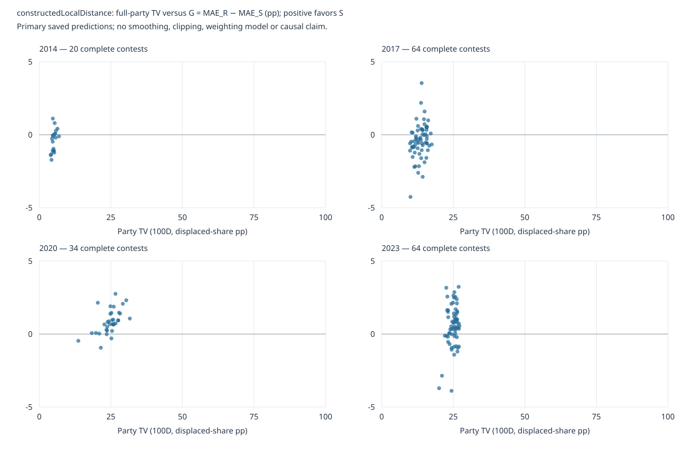
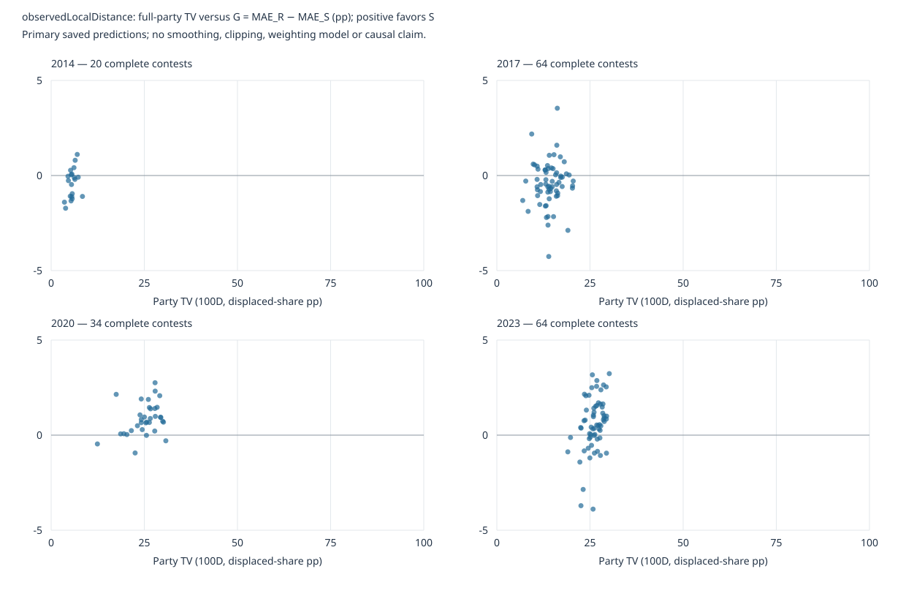

# Stage34 — bounded post-result S/R error patterns and robustness

**Descriptive investigation of frozen Stage33 experts, not new predictive fitting or independent validation.** Contract/inventory208ea60 was committed/pushed before diagnostics. [Frozen contract](stage34-analysis-contract.md) fixes one movement measure, samples, weights and finite sensitivities. Stage33 results/recommendation, coefficients/bounds/predictions and all operational nulls remain unchanged.

## Decision and interpretation

Retain **S and S+R as active complete-share development alternatives**, R-only as a meaningful challenger and baseline as mandatory control. This subsequent decision does not rewrite Stage33's provisional S-default recommendation or discard the joint model. Joint lower environment dispersion deserves continued comparison, while its tiny contest-weighted incremental gain and separated-chronology loss remain visible.

**Recommend A: move to bounded dated-input readiness/replay while retaining these alternatives.** Movement is associated with S/R differences in this finite panel, but upstream input error, feature coverage, constrained fits, partial-election selection and only four environments prevent identifying an adaptive rule. A blend experiment is conceivable later, not the next automatic stage. The likely immediate decision value of realistic dated national/poll/slate/boundary inputs exceeds learning weights from scarce chronological meta-training data.

## Whole-party movement and denominators

TV D=0.5Σ|Ptarget−Psource| uses the entire valid-party simplex, including categories without local candidates. Display100D is displaced-share pp, not individual voter switching. Official nationwide support includes the complete electorate population; no national denominator is rebuilt from selected seats. Source/target local valid-party denominators differ from valid-candidate denominators in the share errors. Stage31 affinity vectors remain conditional on actual target national results, locally coherent and not exactly nationally reconciled.

All five roster audits have complete canonical whole-group alignment; 246 exact-general party-ballot records are available in the full356-seat ledger (including2011 no-fit and cancelled Port Waikato party ballot). All182 primary evaluated contests have distances; there are no movement-only exclusions. Māori/cancelled/nonexact/no-fit cases are retained outside fitted candidate scoring. Diagnostic exclusion machinery never trims original performance rows.

Preserved D017/D022 aliases prevent renamed Conservative/Social Credit/Te Pāti Māori/NewZeal groups generating artificial turnover. Internet-MANA and Freedoms NZ are indivisible ballot groups; constituent affiliation does not identify whole-group continuity. Their documented roster entry/exit is counted as structural displacement, including alliance reorganization, without assigning constituent votes. Missing evidence is never zero-filled. Full mapping/structural/denominator records are in inventory.json and movement.json.

## Four national environments

| Target | Contests | National100D | G: R−S MAE pp | J: S−joint MAE pp |
| --- | --- | --- | --- | --- |
| 2014 | 20 | 5.1292 | -0.4203 | 0.3971 |
| 2017 | 64 | 14.4971 | -0.4162 | -0.0263 |
| 2020 | 34 | 24.8435 | 0.8562 | -0.2477 |
| 2023 | 64 | 25.8918 | 0.5587 | 0.0701 |

The two smaller-national-movement environments favor R;2020/2023 favor S. It is not a strictly increasing four-point relationship:2023 has slightly larger D but smaller G than2020. These are four election environments, not182 independent national observations. No national regression or adaptive weighting rule is fitted.

## Within-election associations

| Target | n | Constructed D slope per10pp | Constructed Spearman | Observed D slope per10pp | Observed Spearman |
| --- | --- | --- | --- | --- | --- |
| 2014 | 20 | 5.3716 | 0.5940 | 2.6787 | 0.4150 |
| 2017 | 64 | 1.7281 | 0.3132 | 0.1941 | 0.0858 |
| 2020 | 34 | 1.3487 | 0.6235 | 0.7119 | 0.3687 |
| 2023 | 64 | 2.6095 | 0.1117 | 2.3369 | 0.3535 |

Constructed-distance slopes are positive in each primary fold, so the story is not merely between elections. Strength varies:2023 rank association is weak. Pooled within-election-centered/equal-total-election slope is 1.6965 pp G per10pp D; correlation 0.3343. Observed-local-distance sensitivity is weaker: slope 0.9134, correlation 0.2353. No significance tests, optimized bins, smoothers or multivariable attribution.

Plots show every available primary point, four fixed panels, TV0–100pp horizontal scale and one shared symmetric vertical scale covering all gains/losses. Axis extent is a layout rule, not a selected effect threshold. Hover labels identify contests. [Complete per-contest data table](../data/processed/diagnostics/s-r-robustness/contest-diagnostics.csv) includes all five branches, candidate counts, support fractions/counts, upstream errors and four model MAEs; analysis.json retains all candidate errors.

## Input/linkage/chronology sensitivities and election influence

| Saved branch | D definition | Centered slope per10pp | Centered correlation | Elections/contests |
| --- | --- | --- | --- | --- |
| primary | constructedLocalDistance | 1.6965 | 0.3343 | 4/182 |
| primary | observedLocalDistance | 0.9134 | 0.2353 | 4/182 |
| strict | constructedLocalDistance | 1.4238 | 0.2715 | 4/182 |
| strict | observedLocalDistance | 0.9602 | 0.2394 | 4/182 |
| separated | constructedLocalDistance | 1.7574 | 0.3663 | 3/162 |
| separated | observedLocalDistance | 0.8892 | 0.2409 | 3/162 |
| observed_retrained | constructedLocalDistance | 0.8318 | 0.1670 | 4/182 |
| observed_retrained | observedLocalDistance | 0.7806 | 0.2049 | 4/182 |
| primary_fixed_to_observed | constructedLocalDistance | 0.9717 | 0.1939 | 4/182 |
| primary_fixed_to_observed | observedLocalDistance | 0.8308 | 0.2167 | 4/182 |

Strict-linkage positive constructed association persists. The observed-input branches attenuate it, so constructed party-input errors are a plausible contributor rather than an explanation ruled out. `observed_retrained` uses separately trained saved fits; `primary_fixed_to_observed` changes only held-out party inputs using primary fits. Neither operation is a new Stage34 fit. When observed local movement and observed inputs are used together,2017 slope is slightly negative and its rank association essentially zero; the pattern is not uniform across all evidence views.

| Branch | Target | Observed-input/observed-D slope | Spearman |
| --- | --- | --- | --- |
| observed_retrained | 2014 | 2.2096 | 0.3895 |
| observed_retrained | 2017 | -0.0957 | 0.0031 |
| observed_retrained | 2020 | 0.8939 | 0.4063 |
| observed_retrained | 2023 | 1.6072 | 0.2071 |
| primary_fixed_to_observed | 2014 | 2.5868 | 0.4692 |
| primary_fixed_to_observed | 2017 | -0.1421 | -0.0264 |
| primary_fixed_to_observed | 2020 | 0.9704 | 0.4283 |
| primary_fixed_to_observed | 2023 | 1.6681 | 0.1908 |

| Branch | Deleted election | Constructed-D slope | Correlation | Observed-D slope | Correlation |
| --- | --- | --- | --- | --- | --- |
| primary | 2014 | 1.5928 | 0.3308 | 0.8423 | 0.2274 |
| primary | 2017 | 1.6880 | 0.3511 | 1.2038 | 0.3115 |
| primary | 2020 | 2.3020 | 0.2960 | 1.1189 | 0.2190 |
| primary | 2023 | 1.5672 | 0.3860 | 0.6243 | 0.1958 |
| strict | 2014 | 1.3353 | 0.2676 | 0.9013 | 0.2348 |
| strict | 2017 | 1.3637 | 0.2677 | 1.2412 | 0.3032 |
| strict | 2020 | 2.0184 | 0.2567 | 1.2727 | 0.2464 |
| strict | 2023 | 1.3284 | 0.3178 | 0.6013 | 0.1832 |
| separated | 2017 | 1.7086 | 0.3859 | 1.1681 | 0.3249 |
| separated | 2020 | 2.0988 | 0.2912 | 0.9459 | 0.1995 |
| separated | 2023 | 1.6653 | 0.4365 | 0.6195 | 0.2052 |
| observed_retrained | 2014 | 0.7602 | 0.1599 | 0.7231 | 0.1977 |
| observed_retrained | 2017 | 0.6513 | 0.1352 | 1.1344 | 0.2928 |
| observed_retrained | 2020 | 1.8627 | 0.2630 | 0.6651 | 0.1430 |
| observed_retrained | 2023 | 0.6438 | 0.1514 | 0.6127 | 0.1835 |
| primary_fixed_to_observed | 2014 | 0.9071 | 0.1885 | 0.7601 | 0.2053 |
| primary_fixed_to_observed | 2017 | 0.7708 | 0.1585 | 1.2235 | 0.3131 |
| primary_fixed_to_observed | 2020 | 2.0887 | 0.2944 | 0.6884 | 0.1477 |
| primary_fixed_to_observed | 2023 | 0.7585 | 0.1784 | 0.6607 | 0.1979 |

All primary delete-one-election centered associations stay positive. This is score/association influence with saved predictions, not deleting an election from expert training or an out-of-time forecast. Adjacent training transitions, repeated seats and national environments remain dependent.

## Competing explanations kept visible

| Target | Slate candidates | Broad R / strict R | Training contests/environments | R θ; bound | Full-vector input MAE | NAT input MAE | LAB input MAE |
| --- | --- | --- | --- | --- | --- | --- | --- |
| 2014 | 143 | 47/42 | 63/1 | 4.0000; [True] | 0.3450 | 0.9127 | 0.6187 |
| 2017 | 431 | 116/104 | 83/2 | 4.0000; [True] | 0.5182 | 2.8189 | 2.8163 |
| 2020 | 286 | 61/50 | 147/3 | 4.0000; [True] | 0.5835 | 1.3374 | 2.3389 |
| 2023 | 459 | 108/78 | 181/4 | 3.6131; [False] | 0.5536 | 2.1996 | 2.2154 |

Broad R coverage falls from47/143 candidates in2014 to108/459 in2023; strict coverage falls to78/459. Training grows from one to four transition environments. R is constrained at+4 in2014/2017/2020, interior in2023. These co-vary with election conditions; no multivariable fit separates them. Major-party input errors are much larger than the all-category average; small-category averaging must not imply perfect candidate inputs. Contest records show slate size, both coverage fractions, training/fit references and upstream signed errors. Coefficient-bound contacts describe constrained expert predictions; unconstrained R behavior is unknown.

| Branch | R group | Candidates / present contests | Baseline MAE | S MAE | R MAE | Joint MAE | G | J |
| --- | --- | --- | --- | --- | --- | --- | --- | --- |
| primary | R_supported | 332/168 | 4.9975 | 3.7519 | 3.8803 | 3.7496 | 0.1284 | 0.0023 |
| primary | R_unsupported | 987/182 | 2.1774 | 1.8826 | 2.0983 | 1.8501 | 0.2157 | 0.0325 |
| strict | R_supported | 274/154 | 4.9596 | 3.8865 | 3.9453 | 3.9020 | 0.0587 | -0.0155 |
| strict | R_unsupported | 1045/182 | 2.3439 | 1.9511 | 2.2330 | 1.9061 | 0.2819 | 0.0450 |
| separated | R_supported | 285/149 | 5.0752 | 3.6765 | 4.0016 | 4.0150 | 0.3252 | -0.3386 |
| separated | R_unsupported | 891/162 | 2.1578 | 1.8081 | 2.0829 | 1.7957 | 0.2748 | 0.0124 |
| observed_retrained | R_supported | 332/168 | 4.9875 | 3.5656 | 3.8430 | 3.6114 | 0.2774 | -0.0457 |
| observed_retrained | R_unsupported | 987/182 | 2.0989 | 1.7888 | 2.0050 | 1.7397 | 0.2161 | 0.0492 |
| primary_fixed_to_observed | R_supported | 332/168 | 5.0283 | 3.5604 | 3.8339 | 3.6134 | 0.2735 | -0.0530 |
| primary_fixed_to_observed | R_unsupported | 987/182 | 2.1078 | 1.8183 | 2.0157 | 1.7666 | 0.1973 | 0.0517 |

Group errors above are candidate-equal; present-contest-equal sensitivities and signed bias are saved with explicit denominators. Unsupported rows remain in complete-slate scores. R acts exponentially on current party intensity and changes other candidates through normalization; it is not a fixed carry-forward bonus. S is historical and can also become stale. S+R is jointly fitted, not a convex average of standalone forecasts. General results are not explained using Māori examples outside the sample.

## Across-election robustness, with baseline-relative control

| Branch | Model | Pooled contest MAE / RMSE | Equal-election mean | Population SD | Range | Worst MAE / election | Gain mean / SD | Worst gain / election |
| --- | --- | --- | --- | --- | --- | --- | --- | --- |
| primary | Baseline | 2.9854 / 5.1829 | 3.0223 | 0.2913 | 0.7829 | 3.3231 / [2023] | 0.0000 / 0.0000 | 0.0000 / [2014, 2017, 2020, 2023] |
| primary | S | 2.4791 / 4.5826 | 2.5324 | 0.4043 | 1.1144 | 3.1152 / [2014] | 0.4899 / 0.5402 | -0.0895 / [2017] |
| primary | R | 2.6430 / 4.5076 | 2.6770 | 0.2820 | 0.7292 | 2.9427 / [2023] | 0.3453 / 0.0608 | 0.2562 / [2020] |
| primary | S+R | 2.4664 / 4.4675 | 2.4841 | 0.2054 | 0.4696 | 2.7180 / [2014] | 0.5382 / 0.4407 | -0.1158 / [2017] |
| strict | Baseline | 2.9854 / 5.1829 | 3.0223 | 0.2913 | 0.7829 | 3.3231 / [2023] | 0.0000 / 0.0000 | 0.0000 / [2014, 2017, 2020, 2023] |
| strict | S | 2.4791 / 4.5826 | 2.5324 | 0.4043 | 1.1144 | 3.1152 / [2014] | 0.4899 / 0.5402 | -0.0895 / [2017] |
| strict | R | 2.6970 / 4.6926 | 2.7196 | 0.2958 | 0.7925 | 3.0439 / [2023] | 0.3027 / 0.0644 | 0.2343 / [2020] |
| strict | S+R | 2.4634 / 4.5382 | 2.4733 | 0.2210 | 0.5208 | 2.7090 / [2014] | 0.5490 / 0.4523 | -0.1273 / [2017] |
| separated | Baseline | 2.9641 / 5.2066 | 2.9815 | 0.3321 | 0.7972 | 3.3331 / [2023] | 0.0000 / 0.0000 | 0.0000 / [2017, 2020, 2023] |
| separated | S | 2.3847 / 4.4943 | 2.3017 | 0.3467 | 0.8443 | 2.6978 / [2017] | 0.6798 / 0.6033 | -0.1618 / [2017] |
| separated | R | 2.6465 / 4.5803 | 2.6750 | 0.3251 | 0.7505 | 2.9733 / [2023] | 0.3065 / 0.0466 | 0.2464 / [2020] |
| separated | S+R | 2.4728 / 4.5243 | 2.4259 | 0.2412 | 0.5779 | 2.7504 / [2017] | 0.5556 / 0.5453 | -0.2144 / [2017] |

| Branch | Target | Baseline gain vs baseline | S gain vs baseline | R gain vs baseline | S+R gain vs baseline |
| --- | --- | --- | --- | --- | --- |
| primary | 2014 | 0.0000 | -0.0023 | 0.4179 | 0.3948 |
| primary | 2017 | 0.0000 | -0.0895 | 0.3267 | -0.1158 |
| primary | 2020 | 0.0000 | 1.1124 | 0.2562 | 0.8647 |
| primary | 2023 | 0.0000 | 0.9391 | 0.3804 | 1.0092 |
| strict | 2014 | 0.0000 | -0.0023 | 0.4084 | 0.4039 |
| strict | 2017 | 0.0000 | -0.0895 | 0.2888 | -0.1273 |
| strict | 2020 | 0.0000 | 1.1124 | 0.2343 | 0.9250 |
| strict | 2023 | 0.0000 | 0.9391 | 0.2792 | 0.9943 |
| separated | 2017 | 0.0000 | -0.1618 | 0.3131 | -0.2144 |
| separated | 2020 | 0.0000 | 1.2219 | 0.2464 | 0.9028 |
| separated | 2023 | 0.0000 | 0.9793 | 0.3599 | 0.9784 |

Primary joint environment SD 0.2054 pp is below baseline 0.2913, S 0.4043 and R 0.2820; its worst average error is also lower. This is useful descriptive robustness supporting continued retention. Equal-election mean favors joint more than original contest weighting because20-seat2014 gains receive a full election weight. It does not replace Stage33's weighting or make2014 representative.

Baseline-relative gains supply a different check: joint still deteriorates in2017, slightly more than S; R-only has the smallest gain dispersion and improves baseline in every primary fold. Joint lower absolute dispersion therefore does not mean uniformly better baseline-relative robustness. Separated chronology has three available folds (no fitted2014); compare all four models on those same folds, not primary four-fold dispersion as if populations matched. Baseline gain dispersion is identically zero by definition, not evidence of perfect robustness. No composite accuracy/variance score or calibrated forecast uncertainty is constructed.

## Largest joint-versus-S contest effects

| Type | Contest | J pp |
| --- | --- | --- |
| gain | Epsom (nz-general-2023-electorate-11) | 5.0908 |
| gain | Epsom (nz-general-2017-electorate-12) | 5.0519 |
| gain | Wairarapa (nz-general-2017-electorate-58) | 2.6784 |
| gain | Port Hills (nz-general-2017-electorate-41) | 2.4062 |
| gain | West Coast-Tasman (nz-general-2014-electorate-61) | 2.3151 |
| loss | Ōhāriu (nz-general-2017-electorate-36) | -4.6383 |
| loss | Napier (nz-general-2020-electorate-26) | -1.9211 |
| loss | Waimakariri (nz-general-2023-electorate-57) | -1.8281 |
| loss | Papakura (nz-general-2017-electorate-40) | -1.7675 |
| loss | Mt Albert (nz-general-2020-electorate-24) | -1.7617 |

Joint improves 92 primary contests, worsens 90, ties 0; all remain in primary summaries. No influential seat removal, expert refit or blend fitting.

## Preservation, verification and finite next decision

Independent arithmetic checks 497 distances, 3560 contest/model errors, 60 robustness identities and 96 centered/influence identities, 38 independent rank associations and 9 raw-denominator distances at frozen tolerances. All 1447 prior data files/raw sources/fits/predictions/adjudications/operational selections remain byte-identical. Actual party-reader candidate-outcome mutations leave movement unchanged; held-out outcome mutations change error diagnostics only with the exact same saved prediction/membership arrays. Final test/CI status is recorded separately in PROJECT_STATE.md/PR.

The evidence is consistent with movement relating to S advantage in constructed-input within-election diagnostics, but attenuated/inconsistent in the observed-input sensitivity. It does not establish a unique mechanism, causal recency, adaptive weights or operational validation. Only four reused development environments, selected exact-seat samples, differing slate/feature support, algorithmic linkage, constrained coefficients and oracle national inputs remain limitations.

Choose A now: bounded dated-input readiness/replay retaining S/S+R/R/baseline. If a separately authorized blend later becomes worthwhile, it must have a fixed blend control, one coherent slate-wide weight, separate national/local adaptation hypotheses, earlier out-of-time expert predictions and explicit scarcity of chronological meta-training (2014 is the first trained expert fold), plus uncertainty in weights beyond national support. A neat four-point relationship alone cannot justify it. No fit/acquisition/forecast/integration begins automatically.
